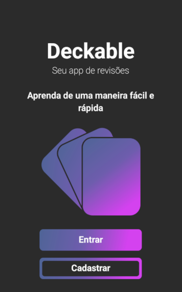
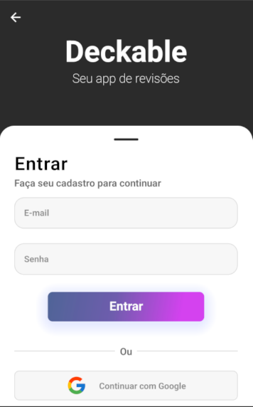
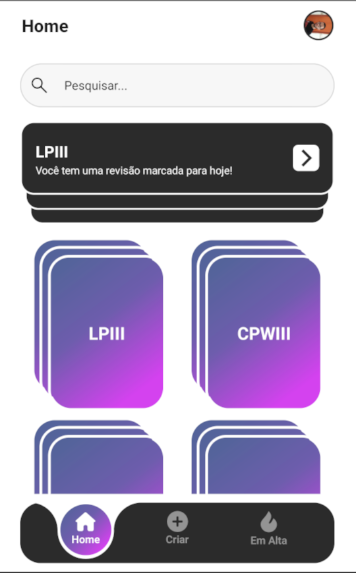
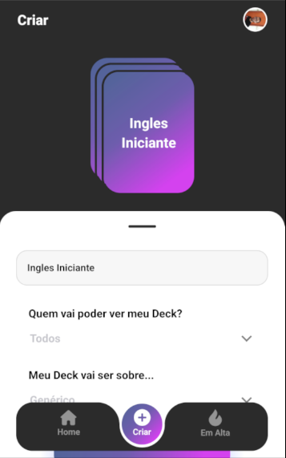
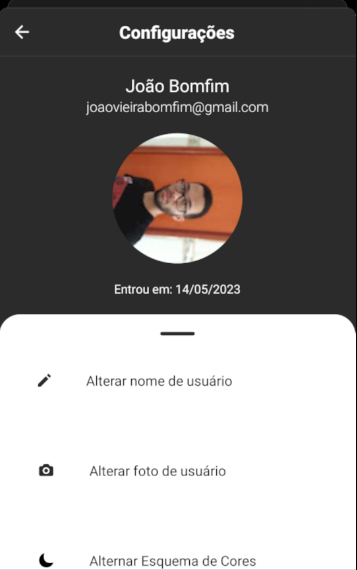
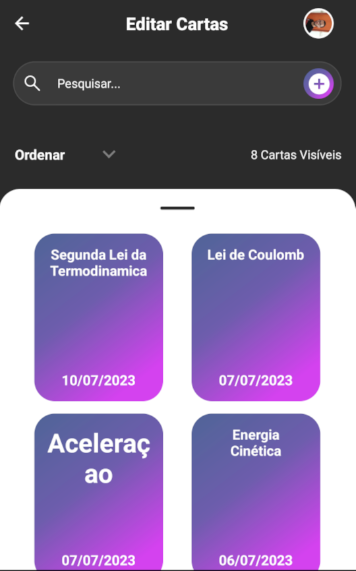

# Deckable: um aplicativo para revisões de conteúdo

O Deckable é um aplicativo Android desenvolvido como Trabalho de Conclusão de Curso para o Curso Superior em Tecnologia de Sistemas para Internet. Seu objetivo é auxiliar o usuário na revisão de conteúdos de forma eficiente e organizada.

Utilizando a Técnica de Revisão Espaçada, o Deckable permite que o usuário crie seus próprios decks e cartas de revisão para praticar e memorizar aquilo que aprendeu. A Técnica de Revisão Espaçada é baseada em uma teoria do conhecimento que procura a melhor abordagem para revisar conteúdos no tempo certo, maximizando o aprendizado e a memorização.

# imagens

